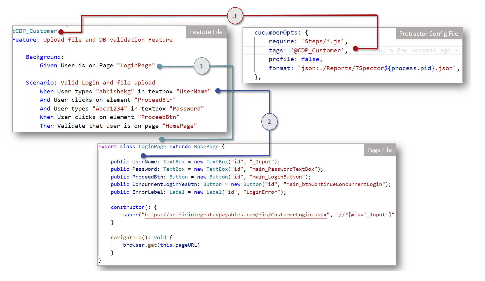
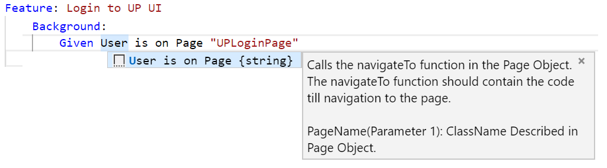

# TSpector | Protractor Cucumber Framework
## Soon to include Winium!
#### Contributors: [Muthupandiyaraja (Muthu) Balasubramanian](mailto:Muthupandiyaraja.Balasubramanian@fisglobal.com), [Ashwini Kumar](mailto:Ashwini.Kumar@fisglobal.com), [Bob Bonanno](mailto:Bob.Bonanno@fisglobal.com), [Abhishek (Abhi) Gaikwad](mailto:abhishek.gaikwad@fisglobal.com), [Rakesh Kulkarni](mailto:Rakesh.Kulkarni@fisglobal.com)

---
## Introduction
The Protractor Framework, is a tool made to automate testing of AngularJS and Non-AngularJS websites. It has been built off of [Protractor](https://www.protractortest.org/). We specifically designed the framework to allow people who are not fluent in coding to be able to create automation scripts. To get started please follow the Installation Instructions for Protractor.

---
## Prerequisites
Please install the following programs on your machine:
 - [NodeJS](https://nodejs.org/en/) (LTS)
 - [Git Client](https://git-scm.com/)
 - [Visual Studio Code](https://code.visualstudio.com/Download) (Recommended)

 Recommended Extension:
 - [Cucumber (Gherkin) Full Support](https://marketplace.visualstudio.com/items?itemName=alexkrechik.cucumberautocomplete)
 - [GitLens — Git supercharged](https://marketplace.visualstudio.com/items?itemName=eamodio.gitlens)

---
## Installation
Please execute following steps for installation:
 - Open Command Prompt and set the location where you want to setup the `TSpector`
   _**Note**: Directory can be changed by `CD` commnand_
 - Clone the repository by issuing the following command
    ```
    git clone https://bitbucket.fnis.com/scm/~e5555287/tspector.git
    ```
 - Open the created folder `TSpector` in Visual Studio Code.
   - File > Open Folder
   - Browse the cloned folder imported using `git clone` command above.
 - Open the integrated terminal of  VS Code by browsing menu Terminal > New Terminal (Cntrl + Shift + `)
 - Install Dependencies using following command in the terminal
    ```
    npm install 
    ```
 - Change chrome driver path in `protractor.conf.ts`.
 - Build project by pressing `Cntrl` + `Shift` + `B` 

---
## Execution
 - For compilation press `Cntrl` + `Shift` + `B` 
 to any `*.ts` file.
 - For running press `Cntrl` + `F5`
 - For debugging the code press `F5`

>**Note:** _You need to build the project everytime you make change_ 
---
## Usage of framework



### Creating Page Files
Easiest way to create a Page file is by using the snippets. Following steps for creation with snippets.
- Create a file with .ts extension in Pages folder of framework
- Start typing "NewPage", autocomplete should help complete this, if not press `Cntrl` + `Space`and it will give you `NewPage`.
- Once you select `NewPage` a basic structure will be ready, which would look like
```JavaScript
import { BasePage } from "../Core/BasePage";
    
    export class Page extends BasePage {
    
       // Your Page elements go here.

        constructor() {
            /* Following are parameter for super
               1. pageURL(string): Link of the page. You can leave this empty as well.
               2. xPathValidator(string): XPath of an element on the page, which can verify if the user if on that page.
               3. timeout(number and Optional): If the page is slower than rest of application, 
                  an additional wait can be added to wait for this page for longer that rest of the pages.
               4. locatortype(string and Optional): If you want to use any other locator other than 'XPath', you can specify if over here. 
                  Supported locators are css, classname, linktext, tagname, xpath, name, partiallinktext, id, model, text, partialbuttontext
            */
            super('','');
        }
    
        navigateTo(): void {
            //Insert your Navigation code here
            
        }
    }
```
- Once the page is create like above, name the page.
- You can add elements to your page now. Following are the elements currently supported.
   - Button
   - Calendar
   - ComboBox
   - DataTable
   - HtmlTable
   - Label
   - LinkLabel
   - TextBox
```JavaScript
public UserName: TextBox = new TextBox("id", "loginName");
/*
Explaination:
 - 'UserName' is the name of element.
 - TextBox is the class from the above elements
 - The first parameter in TextBox is Locator type.
   Supported locators are css, classname, linktext, tagname, xpath, name, partiallinktext, id, model, text, partialbuttontext
 - The second parameter in TextBox is value of the locator.
```

>**Recommendation:**
>- _Add elements above `constructor` to increase readablity_
>- _Keep Page as trailing like `LoginPage extends BasePage` to increase readablity_

### Creating Feature Files
Feature files needs to be created in the Feature folder with `.feature` extension. If you have installed [Cucumber (Gherkin) Full Support](https://marketplace.visualstudio.com/items?itemName=alexkrechik.cucumberautocomplete) extension, you should get autocomplete when you press `Cntrl` + `Space`, as the project is configured to work with it, and all settings are already done. Following is basic feature file
```
@CDP @Set1
Feature: Upload file and DB validation Feature

    Background:
        Given User is on Page "LoginPage"

    @Smoke
    Scenario: Valid Login and file upload
        When User types "abhishekg" in textbox "UserName"
        And User clicks on element "ProceedBtn"
        And User types "Abcd1234" in textbox "Password"
        And User clicks on element "ProceedBtn"
        Then Validate that user is on page "HomePage"
```
Cucumber framework uses Gherkin, and following is the some reference converted with above example for better understanding.
- Feature 
   - The purpose of the `Feature` keyword is to provide a high-level description of a software feature, and to group related scenarios. Eg. `Feature: Upload file and DB validation Feature`.
   - The first primary keyword in a Gherkin document must always be `Feature`, followed by a : and a short text that describes the feature. You can add free-form text underneath Feature to add more description
- **Steps:-** 
   - **Given**
      - Given steps are used to describe the initial context of the system - the scene of the scenario. It is typically something that happened in the past. 
      - Example: `Given User is on Page "LoginPage"`
   - **When** 
      - When steps are used to describe an event, or an action. This can be a person interacting with the system, or it can be an event triggered by another system.
      - Example: `When User types "abhishekg" in textbox "UserName"`
   - **Then**
      - Then steps are used to describe an expected outcome, or result. The step definition of a `Then` step has an assertion to compare the actual outcome (what the system actually does) to the expected outcome (what the step says the system is supposed to do).
      - Example: `Then Validate that user is on page "HomePage"`
   - **And or But:** can be used if you have several Given’s, When’s, or Thens
- Tags
   - We can tag a scenario or a feature by putting an annotation as tag `@CDP` on the line before the `Feature` keyword or `@Smoke` before `Scenario` keyword. If we want  to combine all the scenarios in one feature, for this we have to tag the feature at the beginning of the feature then all the Scenarios will inherit the same tag
   - We can add multiple tags for same Scenario separated with spaces. `@CDP @Set1`. By using tags, we can easily organize our feature and scenarios.
   - This tags can be invoked from CI/CD pipelines (_Jenkins_). 
   - We can configure tag to execute from `protractor.conf` file in `cucumberOpts` with key `tags`
- 

>**Note:** _Entire documentation can be found in [cucumber](https://cucumber.io/docs/gherkin/reference/) offical website._
---
### Details of the steps
You can view the usage of step by pressing `Cntrl` + `Space`.
 



---
*Happy Testing*

---
